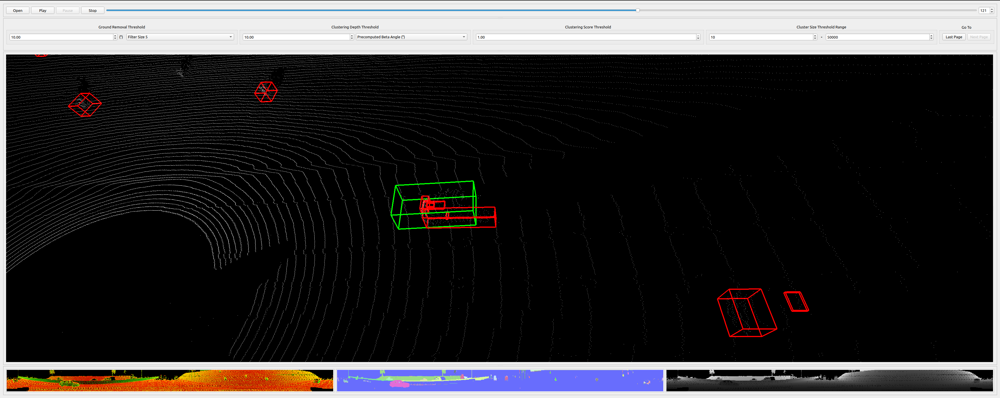
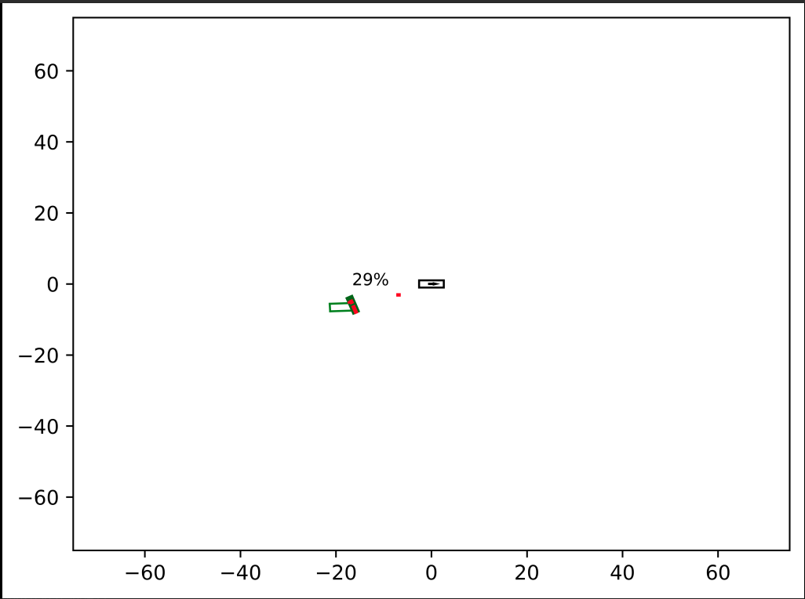

# Verifiable-Obstacle-Detection-Eval

## Paper

[This work was published at ISSRE 2022](https://ieeexplore.ieee.org/document/9978967).

[Submitted Version](https://arxiv.org/pdf/2208.14403.pdf)

```
@inproceedings{bansal2022verifiable,
  title={Verifiable Obstacle Detection},
  author={Bansal, Ayoosh and Kim, Hunmin and Yu, Simon and Li, Bo and Hovakimyan, Naira and Caccamo, Marco and Sha, Lui},
  booktitle={2022 IEEE 33rd International Symposium on Software Reliability Engineering (ISSRE)},
  pages={61--72},
  year={2022},
  organization={IEEE},
  doi={10.1109/ISSRE55969.2022.00017}
}
```

This repository provides details on the evaluations included in this work.

## Requirements
Download the dataset from [Waymo Open Dataset](https://waymo.com/open/).
Copy or link all tfrecord files from the dataset to a flat structure. This location is referred to as `$DATASET`.

```
apt install build-essential cmake tar wget python3-pip python3-numpy python3-opencv python3-shapely
git clone https://github.com/CPS-IL/verifiable-OD.git --recurse-submodules
cd verifiable-OD
python3 -m pip install -r requirements.txt
```


## Detectability Plots

```
cd detectability_plots/
python3 detectability.py
cd ..
```

## Dataset Evaluation


### Setup
The following command extracts lidar, camera, groundtruth, and configuration data in the requisite format.
Note that the extracted groundtruth does not include all obstacles. Refer to the paper for details on these exclusions.

```
cd eval
python3 extract_data.py --dataset $DATASET
cd ..

cd depth_clustering/scripts/depth_clustering
./setup.bash
cd ../../build/amd64/depth_clustering/release
make depth_clustering visualizer
cd ../../../../scripts/depth_clustering
./depth_clustering.bash $DATASET
cd ../../..
```

### Automated Evaluation


```
cd eval
python3 compare.py --dataset $DATASET
python3 evaluate.py --dataset $DATASET
cd ..
```

This will print the list of FN candidates to the stdout as well as `$DATASET/segment-*/top_views/top_view_coverage_FN.json`.

### Manual Analysis
The FN candidates are manually analyzed with the use of several tools.

First, a visualizer showing the obstacle detection output as well as FN candidates.
This visualizer is part of the original [depth_clustering](https://github.com/PRBonn/depth_clustering), adapted for ease of use.

```
cd depth_clustering/scripts/depth_clustering
./visualizer.bash $DATASET/<segment>
```

where \<segment\> refers to the segment being analyzed.


The visualizer shows the point cloud, FN candidates (green) and all detections (red) are shown for easy comparison.



The above also shows two common causes of such FN candidates.
The groundtruth bounding box extends far beyond the actual vehicle.
The vehicle boundary is easily perceived by observing the point cloud.
The second cause is oversegmentation, i.e., while the obstacle is adequately detected, it is detected in several pieces and not one connected obstacle. Due to the limitations of the automated analysis, such cases also require manual identification.


The second utility for such analysis is a visual representation of groundtruth and obstacle comparison.

```
cd eval
python3 compare.py --dataset $DATASET --segment $DATASET/<segment> --frame <frame number> --gt_id <groundtruth id string> --save_images
```



This shows the ego vehicle (black), Obstacle groundtruth for provided id (green), all detections considered for this obstacle, projections and coverage percentage.

## Contact

[Ayoosh Bansal](mailto:ayooshb2@illinois.edu)
